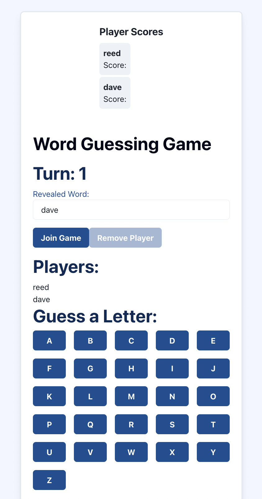

# Yugioh Guessing Game FrontEnd

## Project: Yugioh Guessing Game

### Author: [Your Name]

## Table of Contents

- [Problem Domain](#problem-domain)
- [Links and Resources](#links-and-resources)
- [Collaborators](#collaborators)
- [Setup](#setup)
  - [Environment Requirements](#environment-requirements)
  - [Installation and Running the Application](#installation-and-running-the-application)
- [Usage](#usage)
- [Features](#features)
- [Testing](#testing)
- [UML Diagram](#uml-diagram)

## Problem Domain

The Yugioh Guessing Game is a multiplayer game where players have to guess the names of various Yugioh cards. The game presents a card image, and the player has to enter their guess for the card name. The game checks if the guess is correct and provides feedback to the player. It aims to test the players' knowledge of Yugioh cards while offering an enjoyable gaming experience.

## Links and Resources

- [Github Repository](http://xyz.com) (when applicable)
- [Demo Video](http://xyz.com) (when applicable)

## File Structure

The project follows the following file structure (**updated**):

.
├── README.md
├── package-lock.json
├── package.json
├── public
│ ├── favicon.ico
│ ├── index.html
│ ├── logo192.png
│ ├── logo512.png
│ ├── manifest.json
│ └── robots.txt
└── src
├── App.css
├── App.js
├── App.test.js
├── GameInterface.js
├── GameOver.js
├── Main.js
├── PlayerScores.js
├── button.css
├── index.css
├── index.js
├── logo.svg
├── reportWebVitals.js
├── setupTests.js
└── theme.js

- `.github/workflows/node.yml`: GitHub Actions workflow configuration for Node.js.

## Collaborators

- [Your Name]

## Setup

### Environment Requirements

- No specific environment variables are required at the moment.

### Installation and Running the Application

1. Clone the repository: `git clone [https://github.com/your-username/yugioh-guessing-game.git]`
2. Navigate to the project directory: `cd yugioh-guessing-game`
3. Install dependencies: `npm install`
4. Start the application: `npm start`

### Usage

1. Open the Yugioh Guessing Game application in a web browser.
2. The game will present an image of a Yugioh card.
3. Enter your guess for the card name in the provided text input.
4. Click the "Submit" button to submit your guess.
5. The game will check if your guess is correct and provide feedback.
6. Continue playing by guessing the names of different Yugioh cards.

## Features

- Display: The game displays images of Yugioh cards for the players to guess.
- Input: Players can enter their guesses for the card names.
- Feedback: The game provides feedback to the players, indicating whether their guess is correct or incorrect.

## Testing

- Automated tests can be run using the command: `npm test`
- The tests cover the functionality of the game, including card display, player input, and feedback mechanisms.

## UML Diagram

This UML diagram represents the structure and flow of the Yugioh Guessing Game. It illustrates the different components and their interactions, including card display, player input, and feedback handling.
